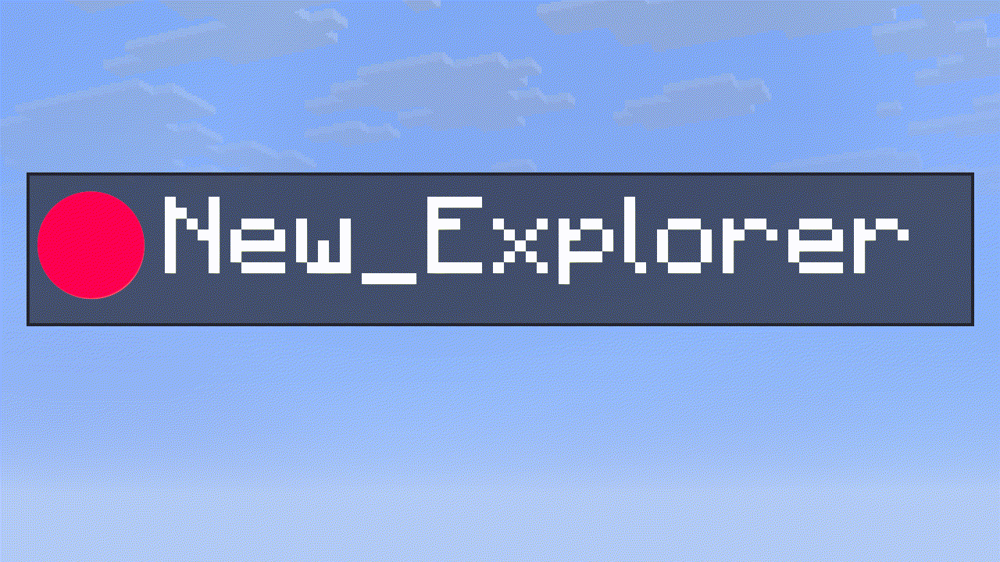
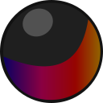
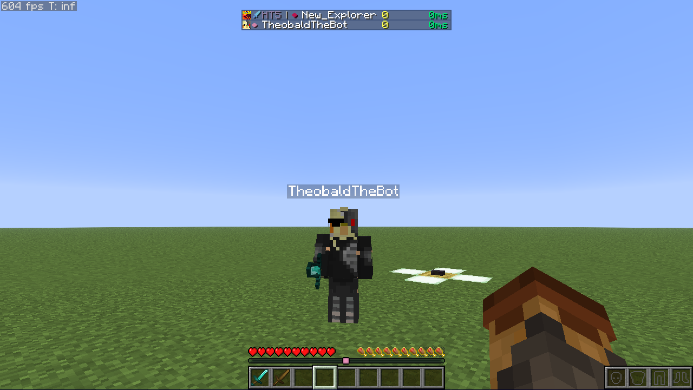
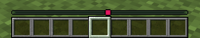
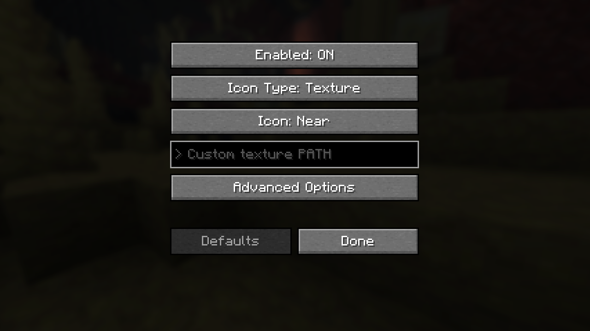
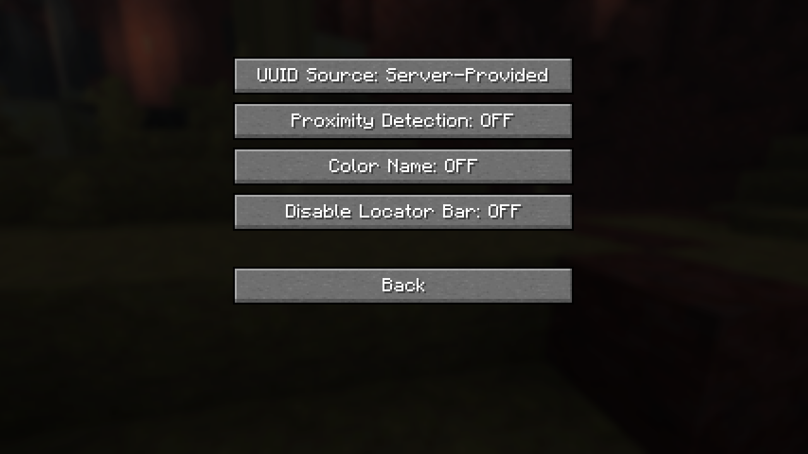

# Locator Display
### Just a Client-Sided Locator Bar Color Display Mod
Locator Display is a client-side Minecraft mod that adds a customizable symbol 
next to player names in the tab list, colored exactly like their locator bar color.

## Features
- Displays a customizable colored symbol before each player's name in the tab list.
- Customize the symbol by choosing one of the characters in the preset or by specifying a custom one: `⬤, ▌, ⬛, ★, ◆, ▶, ✚, ✖`
- Display an icon or a texture instead of a symbol.
- Choose to color player names.
- Proximity Detection shows how far or near a player is from you.
- Allows disabling the locator bar and only displaying the experience bar.
- Choose to use the Server-Provided or the official Mojang UUID for accurate colors.
- Falls back to a deterministic offline UUID for players not registered with Mojang.
- Fully client-side; works on any SMP.
- Turns off in servers with thousands of players in the tab list(minigames, pvp servers)

## Requirements
- Minecraft 1.21.6+
- Fabric Loader 0.19.3+
- Java 21+
- ModMenu (recommended)

## Installation
1. Download the latest appropriate `.jar` from one of our official pages(CurseForge or Modrinth).
2. Place the file into your `.minecraft/mods` folder.
3. Launch Minecraft with the Fabric Loader.

## How It Works
1. The mod fetches the player's UUID either from the client or from the public Mojang API.
2. It computes a color from the UUID using the same algorithm as the locator bar.
3. The specified symbol is prepended to the player's name in the tab list.

## Configuration
Mod is configurable with ModMenu.

### Options:
- `Enabled` → to turn the mod on and off
- `Icon Type` → Select either `Texture` or `Symbol`
- `Icon` → `Near`, `Nearby`, `Far`, `Distant`, `Bowtie` 
- `> Custom (max length 3)` or `> Custom texture PATH` → If `Custom` was specified in the previous selection, put your custom configuration here
  - Custom Symbol:
    - input at most 3 characters
    - those characters will be prepended to the player name
    - the character must be renderable by Minecraft
    - Example: `>> Player_Name`
  - Custom Icon:
    - Allows instance-loaded textures to be used
    - `modid:block/custom_block`
    - accepts only directories inside the `textures/` directory of any instance
    - for Minecraft, any texture inside: `block`, `colormap`, `effect`, `entity`, `environment`, `font`, `gui`, `item`, `map`, `misc`, `mob_effect`, `painting`, `particle`, `trims`
    - Example input:
      - `block/dirt`
      - `minecraft:item/iron_sword`
      - `hud/heart/full.png`
      - `minecraft:textures/block/glowstone.png` → the correct input, the mod formats everything into this
    - Recommended: Use light textures(ones that do not contain a lot of dark pixels)

- `Advanced Options`:
  - `UUID Source` → can either be `Server-Provided` or `Official Mojang`(from the Mojang API)
  - `Proximity Detection` → Disables icon customization, makes the icon smaller or bigger like the locator bar. For players in a different dimension, a bowtie will be displayed.
  - `Color Name` → change the color of the player names into their locator bar color
  - `Disable Locator Bar` → as the name suggests, forces only the Experience Bar to appear
- `Defaults` → sets all options to the defaults
- `Done` → Saves the configuration and exits

## Disclaimer
This is free software: you are free to change and redistribute it.
There is NO WARRANTY, to the extent permitted by law.

## License
Code: GPL-3.0-only  
Assets (logo/icon/screenshots/etc): CC BY-NC-ND 4.0 (see [LICENSE-ASSETS](LICENSE-ASSETS))

## Contributing
Open an issue if you find a bug or have a feature request.
If you want to contribute code-wise, make sure to check the [TODO](TODO) file and opened issues on GitHub.
By contributing to this repository you agree that all additions/modifications will be licensed
under GPLv3-only and you agree to allow distribution in compiled form.

## Credits
Based on the Fabric example mod template (CC0).
